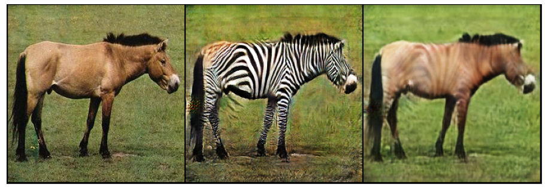
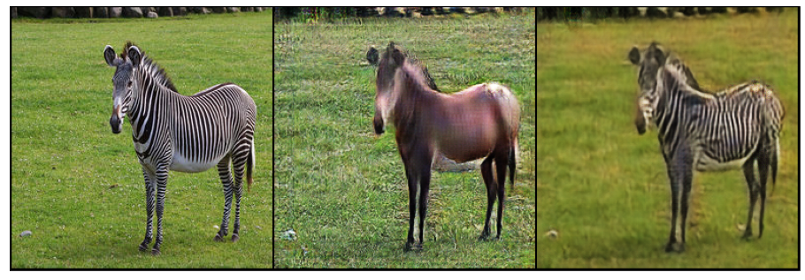
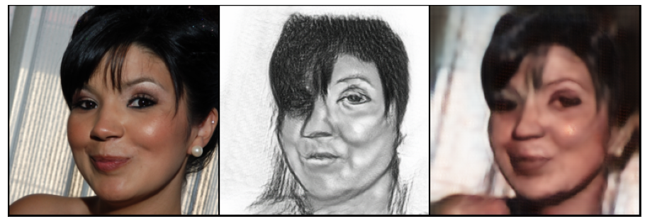
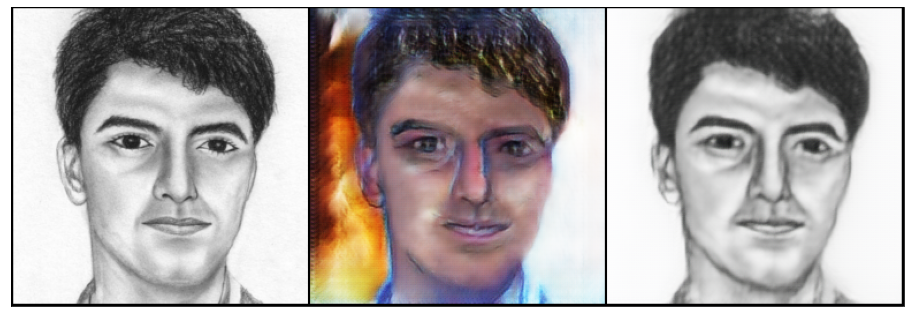

# CycleGAN
Implementetion of [CycleGAN](https://arxiv.org/abs/1703.10593) model.
Model was trained for 2 tasks: : **Horses -> Zebra** and  **Photo -> Pencil Portrait**.
<br>

## Run test demo
To install Streamlit:
```bash
$ pip install streamlit
```
To run test demo:
```bash
$ streamlit run test.py
```

## Datasets
### Horses -> Zebra
[Link](https://people.eecs.berkeley.edu/~taesung_park/CycleGAN/datasets/horse2zebra.zip) to dataset.<br>
Download dataset into datasets folder:<br>
```bash
$ cd datasets/
$ python3 download_horse2zebra.py
```
### Photo -> Pencil Portrait
#### Faces
Part of [Flickr Faces](https://github.com/NVlabs/ffhq-dataset)  dataset was used. It can be downloaded from [here](https://drive.google.com/file/d/1KWPc4Pa7u2TWekUvNu9rTSO0U2eOlZA9/view?usp=sharing).<br>
Download dataset into datasets folder:<br>
```bash
$ cd datasets/
$ python3 download_faces.py
```
#### Pencil sketch
Dataset is taken from [Kaggle](https://www.kaggle.com/datasets/arbazkhan971/cuhk-face-sketch-database-cufs).  Only original_sketch folder is used. To start training need to downlod and unzip into 'datasets' folder.

## Train model
To run training:
```bash
$ python3 train.py
```
```text
optional arguments:
  --dataset DATASET                      dataset name. Possible values: horse2zebra, photo2portrait.
                                         Default: horse2zebra.
  --epochs N                             number of epochs. Default 100.
  --load_weights_path LOAD_WEIGHTS_PATH  path to weights to continuer training. Default None.
  --lr LR                                lerning rate. Default 0.0002.
  --epoch_decay N                        epoch to start descrease learning rate. Default 60.
  --lambda_identity LAMBDA_IDENTITY      weight for identity loss. Default 5.
  --lambda_cycle LAMBDA_CYCLE            weight for cycle loss. Default 10.
```

## Results
### Horses -> Zebra
Model was trained on [horses2zebra](https://people.eecs.berkeley.edu/~taesung_park/CycleGAN/datasets/) dataset for 120 epochs with following parameters: lr = 0.0002, lambda_identity = 5, lambda_cycle = 10. Starting from 60th epoch lr was reduced by 2 times each 10 epochs.<br>
Losses and examples can be found in [results.ipynb](results.ipynb)
### Photo -> Pencil Portrait
Model was trained on part of [Flickr Faces](https://github.com/NVlabs/ffhq-dataset)  dataset and dataset of pencil paitings taken from [Kaggle](https://www.kaggle.com/datasets/arbazkhan971/cuhk-face-sketch-database-cufs) for 30 epochs with following parameters: lr = 0.0001, lambda_identity = 10, lambda_cycle = 10.<br>
Losses and examples can be found in [results.ipynb](results.ipynb)

## Examples of generated images
<br>
<br>
<br>
<br>
